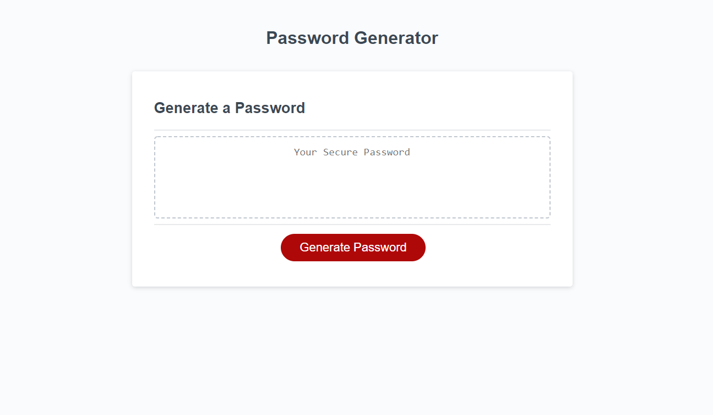

# Password-Generator

## Project: 

To create an application that generates random passwords based on criteria that is being selected.

-----
## Details:

* User is presented with information on the required length of their password. No less than 8 and no more than 128.

* Depending on the users selected number of characters. An [ALERT] message will then appear, stating: 

    "Password too short." or "Password too long". 

* User is able to select which criteria to include in their password just by clicking on the "ok" or "Cancel" button.
    

* Users input is then validated and a password is generated matching their selected criteria.    

*  The generated password is then displayed inside the generated password box. 

-----------

 

